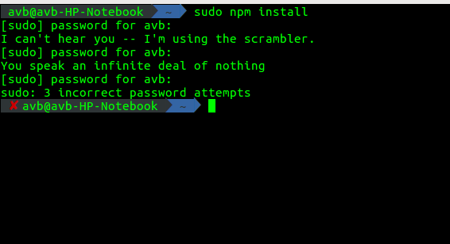

Lets Have Some Fun!
===================

----------


### 1) thefuck-command
-------------

#### Installation


run `pip install thefuck` in terminal.

#### Running


### 2) aria2 - Terminal Based Downloader
-------------

#### Installation


run `sudo apt-get install aria2` in terminal.

#### Running
*  open Terminal in the directory where you want to download the file.
*  type `aria2c -x16 "paste the link here"` in the terminal.
*  the file will be downloaded.

### 3) z- Directory Jumper
-------------

#### Installation
* Go to `https://github.com/rupa/z` and download the repo and extract it somewhere.
* Copy the `z.sh` file to home directory.
*   `echo ". ~/z.sh" >> ~/.bashrc` add this line in .bashrc file located in the home directory.

#### Running
*  cd around for a while to build up the db.
*  use `z "keywords of the directory"` to move to any directory.
*  Note: What z does is make a database of where you go using cd command. so only the directories which you have gone using cd can be used in z.

### 4) elinks-Terminal Browser
-------------

#### Installation
* `sudo apt-get install elinks`

#### Running
*  type `elinks` and browse!!


### 5) Cowsay and Xcowsay
-------------

#### Installation
* `sudo apt-get install cowsay`
*  `sudo apt-get install xcowsay`

#### Running
*  `cowsay hello`
*  `xcowsay hello`


### 6) sl
-------------

#### Installation
* `sudo apt-get install sl`

#### Running
*  `sl`


### 7) fortune
-------------

#### Installation
* `sudo apt-get install fortune`

#### Running
*  `fortune`

### 8) Banner
-------------
#### Running
*  `figlet hello`

### 9) Pi
-------------
#### Installation
* `sudo apt-get install pi`

#### Running
*  `pi some integer`

### 10) xeyes
-------------
#### Running
* `xeyes`

### 11) espeak
-------------
#### Installation
* `sudo apt-get install espeak`

#### Running
*  `espeak "Hello We Are From GeekHaven"`

### 12) Twitter Status Update
----------
url -u YourUsername:YourPassword -d status="Your status message" http://twitter.com/statuses/update.xml

### 13) asciiviewer
----------
#### Installation
* `sudo apt-get install aview`

#### Running
* `asciiview some_image.png -driver curses`

### 14) screenfetch - Generate OS and System Info
----------
#### installation
* Debian based distribution: `sudo apt-get install screenfetch`
* Fedora or CentOS: `yum install screenfetch`

#### Running
* `screenfetch`

### 15) youtube-dl
----------
* `pip install --user youtube-dl`
#### Running
* `youtube-dl https:"youtube video link"`

### 16) Star Wars - Watch an ASCII Version of Star Wars
----------
#### Usage
* `telnet towel.blinkenlights.nl`

#### Etc.
* Streams the content which is broadcasted via the blinkenlights.nl domain.

### 17) rig - generate fake idenities
----------
#### Usage
```
        rig
        Bettye Dunlap
        799 Second St
        Denver, CO  80202
        (303) xxx-xxxx
```

### 18) toilet - draw banners again
---------
#### Usage
* 'toilet Welcome'

### 19) Automatically update all the installed python packages
-------------
#### Running
* `pip freeze --local | grep -v '^\-e' | cut -d = -f 1 | xargs -n1 pip install -U`

### 20) lynx-Terminal Browser
-------------

#### Installation
* `sudo apt-get install lynx`

#### Running
*  type `lynx` and browse!!


### 21) axel - Terminal Based Downloader
-------------

#### Installation


run `sudo apt-get install axel` in terminal

#### Running
*  open Terminal in the directory where you want to download the file.
*  type `axel "paste the link here"` in the terminal.
*  the file will be downloaded.

### 22) sl - Steam Locomotive
-------------

#### Installation
* `sudo apt-get install sl`

#### Running
*  type `sl` and watch the train!

### 23) Give The Terminal An Attitude
-------------
#### Steps
* `sudo visudo`
* Add `Defaults insults` at the end of the file and save it
* Whenever you type wrong password while using sudo you will get to know the magic!!


### 24) cmatrix - Matrix screen
-------------

#### Installation
* `sudo apt-get install cmatrix`

#### Running
*  type `cmatrix` and watch the coolest screen ever!


### 25) Cowsay
-------------

#### Installation
* `sudo apt-get install cowsay`

#### Running
*  `cowsay hello`

### 26) yes
-------------
#### Running
*  `yes <word which you want to loop>`
* Example Usage : `yes HelloWorld`

### 28) rev
-------------

#### Running

* type `rev`
* type the word you want to reverse

### 29) lolcat
-------------

#### Installation
* `sudo apt-get install gem`
* `gem install lolcat`

#### Running

* echo "Hello world" | lolcat
* fortune | cowsay | lolcat
